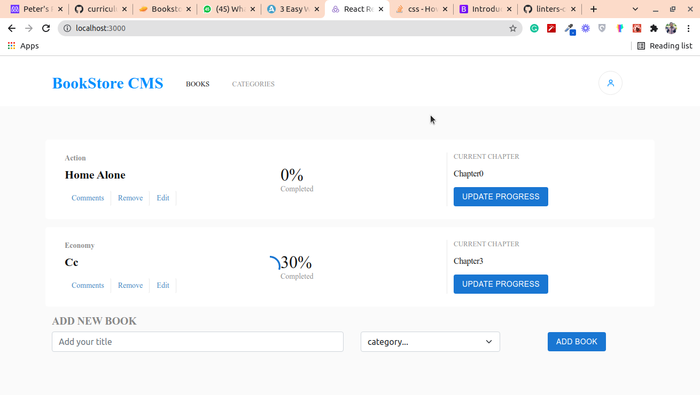

# Title

This Bookstore allows you to: Display a list of books. Add a book. Remove a selected book.
  

## Live demo
[Bookstore](https://p-books.netlify.app)
## Built With

- React

- CSS

- Boostrap

- Visual Studio Code

- Git & Github

## Getting Started
To get a local copy up and running follow these simple example steps.

### Setup
* Open terminal
* Clone this project by command git clone(https://github.com/peterdgreat/books-store.git)
* Cd books-store

### install
Run the following command to have all npm packages dependencies installed:

npm install

### Usage

To start the webpack-dev-server, run the following command:

npm run start

## Authors

👤 **Ajayi Peter**

- GitHub: [@peterdgreat](https://github.com/peterdgreat)
- Twitter: [@dev_peter_O](https://twitter.com/dev_Peter_O)
- LinkedIn: [ajayipeter](https://www.linkedin.com/in/ajayipeter/)

## Show your support

Give a ⭐️ if you like this project!

## Acknowledgments
- Hat tip to anyone whose code was used
- Inspiration
- etc
